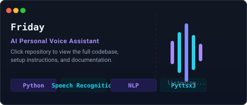
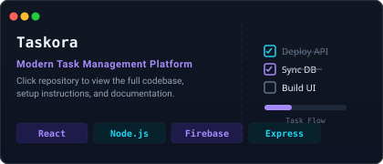
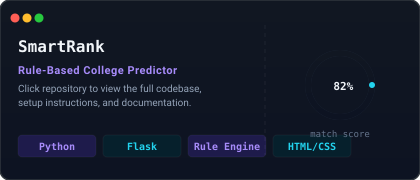
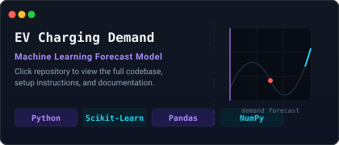
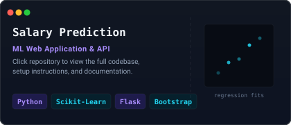
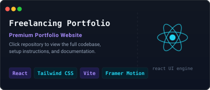

<div align="center">


<br/>

<a href="https://linkedin.com/in/jaithra-addepalli-510292334">
  
</a>
<a href="https://instagram.com/jaithra_mca_">
  
</a>
<a href="mailto:jaithraaddepalli17@gmail.com">
  
</a>
<a href="https://github.com/Jaithra2104">
  
</a>

<br/><br/>

<a href="https://github.com/Jaithra2104">
  
</a>

</div>

<br/>

## 🧑‍💻 Profile Avatar & Identity

<div align="center">

<h3><code>jaithra@github ~ $ whoami</code></h3>

<table border="0" cellpadding="0" cellspacing="0" style="border-collapse: collapse; border: none; background: transparent;">
<tr style="background: transparent; border: none;">
<td valign="top" style="border: none; background: transparent; padding: 5px;">
  
</td>
<td valign="top" style="border: none; background: transparent; padding: 5px;">
  
</td>
</tr>
</table>

</div>

<br/>

## About Me

I'm **Jaithra Addepalli**, a Computer Science Engineering student from India, passionate about building software that solves real problems. My interests span:

- **Software Engineering** — writing clean, maintainable, production-grade code
- **Artificial Intelligence & Machine Learning** — building models that learn from data
- **Full Stack Development** — designing and shipping complete web applications
- **Data Analytics** — turning raw data into actionable insight

**Currently learning:** Generative AI · AWS · Docker · System Design

I enjoy solving real-world problems through technology and continuously sharpening my technical and problem-solving skills.

<br/>

## Featured Projects

<table width="100%" border="0" cellpadding="5" cellspacing="5" style="border-collapse: collapse; border: none; background: transparent;">
  <tr style="background: transparent; border: none;">
    <td width="50%" style="border: none; background: transparent; padding: 5px;">
      <a href="https://github.com/Jaithra2104" target="_blank">
        
      </a>
    </td>
    <td width="50%" style="border: none; background: transparent; padding: 5px;">
      <a href="https://github.com/Jaithra2104" target="_blank">
        
      </a>
    </td>
  </tr>
  <tr style="background: transparent; border: none;">
    <td width="50%" style="border: none; background: transparent; padding: 5px;">
      <a href="https://github.com/Jaithra2104" target="_blank">
        
      </a>
    </td>
    <td width="50%" style="border: none; background: transparent; padding: 5px;">
      <a href="https://github.com/Jaithra2104" target="_blank">
        
      </a>
    </td>
  </tr>
  <tr style="background: transparent; border: none;">
    <td width="50%" style="border: none; background: transparent; padding: 5px;">
      <a href="https://github.com/Jaithra2104" target="_blank">
        
      </a>
    </td>
    <td width="50%" style="border: none; background: transparent; padding: 5px;">
      <a href="https://github.com/Jaithra2104" target="_blank">
        
      </a>
    </td>
  </tr>
</table>

<br/>

## Tech Stack

**Programming Languages**


**Frontend**


**Backend**


**Databases**


&nbsp;


**Machine Learning**


**Analytics**


**Deployment**


&nbsp;


**Tools**


<br/>

## GitHub Analytics

<div align="center">


<br/>


<br/>


</div>

<br/>

### Trophies

<div align="center">

</div>

<br/>

### Contribution Snake

<div align="center">

<picture>
  <source media="(prefers-color-scheme: dark)" srcset="https://raw.githubusercontent.com/Jaithra2104/Jaithra2104/output/github-contribution-grid-snake-dark.svg" />
  <source media="(prefers-color-scheme: light)" srcset="https://raw.githubusercontent.com/Jaithra2104/Jaithra2104/output/github-contribution-grid-snake.svg" />
  
</picture>

<br/><sub>Generated automatically by the workflow in <code>.github/workflows/snake.yml</code> — see setup instructions below.</sub>

</div>

<br/>

## Snake Animation Setup

1. This repository must be your **profile repository** (a repo named exactly `Jaithra2104`, matching your username).
2. Commit the included `.github/workflows/snake.yml` to the `main` branch.
3. In the repo settings, confirm **Settings → Actions → General → Workflow permissions** is set to **Read and write permissions**.
4. Run the workflow once manually from the **Actions** tab (`Generate Contribution Snake` → **Run workflow**), or wait for the daily scheduled run.
5. The action publishes the generated SVGs to a new `output` branch. The README above already links to:
   - `https://raw.githubusercontent.com/Jaithra2104/Jaithra2104/output/github-contribution-grid-snake.svg`
   - `https://raw.githubusercontent.com/Jaithra2104/Jaithra2104/output/github-contribution-grid-snake-dark.svg`
6. No further changes are needed — the animation updates automatically every day.

<br/>

## Learning Roadmap

```
Current Focus
├── Generative AI        → building & fine-tuning LLM-powered applications
├── AWS                  → cloud fundamentals & deployment
├── Docker               → containerization for reproducible environments
└── System Design        → scalable architecture fundamentals
```

<br/>

## Open Source Goals

- Contribute meaningful pull requests to active open-source projects
- Maintain at least one well-documented personal open-source repository
- Build in public and share progress consistently

<br/>

## Fun Facts

- I like turning half-finished side projects into fully shipped products.
- I'm most productive late at night with a good playlist running.
- I believe clean code is a form of respect for your future self.

<br/>

## Developer Quote

> "First, solve the problem. Then, write the code." — John Johnson

<br/>

## Connect With Me

<div align="center">

<a href="https://linkedin.com/in/jaithra-addepalli-510292334">
  
</a>
<a href="https://instagram.com/jaithra_mca_">
  
</a>
<a href="mailto:jaithraaddepalli17@gmail.com">
  
</a>

<br/><br/>


</div>

<br/>


</div>
