 

  

 

## 🧑‍💻 Profile Avatar & Identity

<h3><code>jaithra@github ~ $ whoami</code></h3>

<table border="0" cellpadding="0" cellspacing="0" style="border-collapse: collapse; border: none; background: transparent;">
<tr style="background: transparent; border: none;">
<td valign="top" style="border: none; background: transparent; padding: 5px;">
  
</td>
<td valign="top" style="border: none; background: transparent; padding: 5px;">
  
</td>
</tr>
</table>

 

## 👤 About Me

> 🚀 **Engineering high-quality software solutions that address real-world challenges through code.**

I'm **Jaithra Addepalli**, a Computer Science Engineering student from India. I specialize in building robust backend systems, training machine learning models, and crafting modern web interfaces. I am highly motivated by clean code, scalable architecture, and continuous learning.

### 💡 Core Focus Areas

*   💻 **Software Engineering** — *Writing clean, modular, and production-grade code that scales.*
*   🤖 **Artificial Intelligence & Machine Learning** — *Building predictive models, feature pipelines, and data-driven engines.*
*   🌐 **Full Stack Development** — *Designing and shipping end-to-end web applications with modern architectures.*
*   📊 **Data Analytics** — *Processing raw datasets to uncover hidden trends and actionable insights.*

 
## Featured Projects

<table width="100%" border="0" cellpadding="5" cellspacing="5" style="border-collapse: collapse; border: none; background: transparent;">
  <tr style="background: transparent; border: none;">
    <td align="center" width="50%" style="border: none; background: transparent; padding: 5px;">
      
    </td>
    <td align="center" width="50%" style="border: none; background: transparent; padding: 5px;">
      
    </td>
  </tr>
  <tr style="background: transparent; border: none;">
    <td align="center" width="50%" style="border: none; background: transparent; padding: 5px;">
      
    </td>
    <td align="center" width="50%" style="border: none; background: transparent; padding: 5px;">
      
    </td>
  </tr>
  <tr style="background: transparent; border: none;">
    <td align="center" width="50%" style="border: none; background: transparent; padding: 5px;">
      
    </td>
    <td align="center" width="50%" style="border: none; background: transparent; padding: 5px;">
      
    </td>
  </tr>
</table>

 

## Tech Stack

  
  

 
## GitHub Analytics

  <table width="100%" border="0" cellpadding="0" cellspacing="0" style="border-collapse: collapse; border: none; background: transparent; margin-bottom: 10px;">
    <tr style="background: transparent; border: none;">
      <td align="center" width="55%" style="border: none; background: transparent; padding: 5px;">
        
      </td>
      <td align="center" width="45%" style="border: none; background: transparent; padding: 5px;">
        
      </td>
    </tr>
  </table>
  
   
  
  
  
    
  
  

 

### Trophies

 

### Contribution Snake

<picture>
  <source media="(prefers-color-scheme: dark)" srcset="https://raw.githubusercontent.com/Jaithra2104/Jaithra2104/output/github-contribution-grid-snake-dark.svg" />
  <source media="(prefers-color-scheme: light)" srcset="https://raw.githubusercontent.com/Jaithra2104/Jaithra2104/output/github-contribution-grid-snake.svg" />
  
</picture>

 Generated automatically by the workflow in <code>.github/workflows/snake.yml</code> — see setup instructions below.

 

## Snake Animation Setup

1. This repository must be your **profile repository** (a repo named exactly `Jaithra2104`, matching your username).
2. Commit the included `.github/workflows/snake.yml` to the `main` branch.
3. In the repo settings, confirm **Settings → Actions → General → Workflow permissions** is set to **Read and write permissions**.
4. Run the workflow once manually from the **Actions** tab (`Generate Contribution Snake` → **Run workflow**), or wait for the daily scheduled run.
5. The action publishes the generated SVGs to a new `output` branch. The README above already links to:
   - `https://raw.githubusercontent.com/Jaithra2104/Jaithra2104/output/github-contribution-grid-snake.svg`
   - `https://raw.githubusercontent.com/Jaithra2104/Jaithra2104/output/github-contribution-grid-snake-dark.svg`
6. No further changes are needed — the animation updates automatically every day.

 

## 🎯 Learning Roadmap

| Focus Area | Technologies | Status |
| :--- | :--- | :--- |
| 🧠 **Generative AI** | LLMs · Prompt Engineering · RAG | Learning & Experimenting |
| ☁️ **Cloud Infrastructure** | AWS Services · Serverless · IAM | Certification Prep |
| 🐳 **DevOps & Containers** | Docker · CI/CD Pipelines | Containerizing Side Projects |
| 🏗️ **System Design** | Microservices · Caching · Scalability | Studying Architectures |

 
## Open Source Goals

- Contribute meaningful pull requests to active open-source projects
- Maintain at least one well-documented personal open-source repository
- Build in public and share progress consistently

 

## Fun Facts

- I like turning half-finished side projects into fully shipped products.
- I'm most productive late at night with a good playlist running.
- I believe clean code is a form of respect for your future self.

 

## Developer Quote

> "First, solve the problem. Then, write the code." — John Johnson

 

## Connect With Me

  

 

